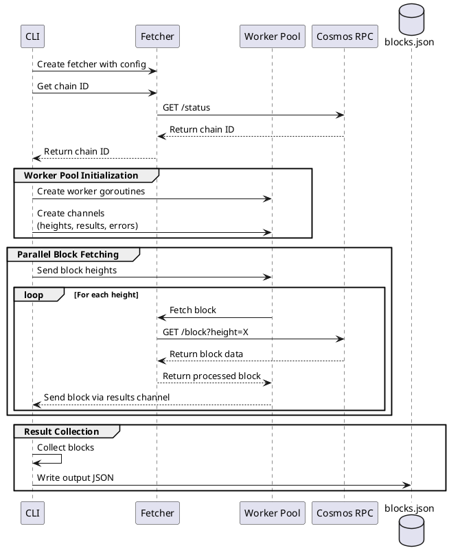

# Range Technical Assignment

# Assignment: Parallelized Resilient Cosmos Block Fetcher
# Objective

# Build a Golang application that:

1. Connects to a Cosmos-based blockchain node via its RPC API.
   
    1. Fetches blocks in parallel.
   
    2. Extracts and stores specific metadata:
   
        • Block height.
        • Number of transactions.
        • Network ID (chain ID).

2. Ensures resilience by handling retries and failures grace fully.

# Requirements

## Block Fetching:
    
    • Fetch blocks in parallel using the Cosmos RPC endpoint /block

## Range Technical Assignment
    
    • Implement concurrency to speed up the fetching process.

## Metadata Extraction:

    • For each block, extract:
    • height (block height).
    • num_txs (number of transactions in the block).
    • network_id (chain ID, fetched once via /status).

## Storage
    
    • Store the extracted metadata in one or multiple json file

## Error Handling
    
    • Implement retry logic for failed block fetches.
    • Ensure the application can recover gracefully from transient network or API failures.

## CLI Interface
    
    • Accept parameters to configure the block range to fetch (e.g., --start-height, --end-height).
    • Provide a flag to specify the Cosmos node RPC endpoint (e.g., --node-url).

## Concurrency Management
    
    • Allow configuration of the number of parallel fetchers(e.g., --parallelism).
    • Ensure no race conditions occur when storing metadata.

# Deliverables

1. A GitHub repository containing

    • The Golang source code.
    • A README.md file with setup instructions and examples of usage.

2. Example commands to run the program

    • Fetch blocks from height x to y (provide recent block range)


# workflow


<!--

-->


## Usage

Basic usage with default settings:

```
cosmos-block-fetcher --start-height 1000000 --end-height 1000100 --node-url https://rpc.cosmos.network:26657
```

advanced configuration:


```bash

cosmos-block-fetcher \
--start-height 1000000 \
--end-height 1000100 \
--node-url https://rpc.cosmos.network:26657 \
--parallelism 10 \
--output-file blocks.json \
--retry-attempts 3 \
--retry-delay 1s

```


### Flags

| Flag | Description | Default |
|------|-------------|---------|
| `--start-height` | Starting block height | Required |
| `--end-height` | Ending block height | Required |
| `--node-url` | Cosmos RPC endpoint URL | Required |
| `--parallelism` | Number of parallel fetchers | 5 |
| `--output-file` | Output JSON file path | `blocks.json` |
| `--retry-attempts` | Number of retry attempts | 3 |
| `--retry-delay` | Delay between retries | `1s` |

## Example


```shell
go run .  \
 --start-height 23133000 \
 --end-height 23133086 \
 --node-url https://cosmos-rpc.publicnode.com:443  \
 --retry-attempts 5 \
 --retry-delay 2s
```

## Output Format

The program generates a JSON file with the following structure:


```json
{
  "chain_id": "cosmoshub-4",
  "blocks": [
    {
      "height": 23133003,
      "num_txs": 6
    }
  ]
}
```