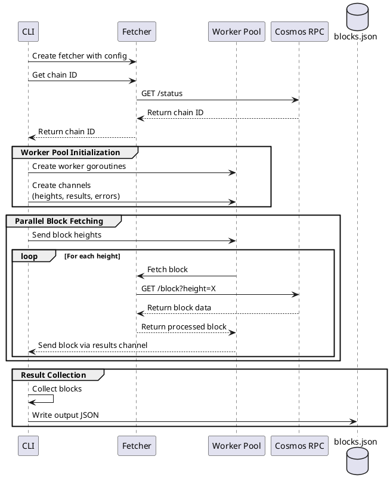

# Cosmos Block Fetcher

A high-performance, reliable tool for fetching and processing Cosmos blockchain blocks with built-in retry mechanisms and monitoring capabilities.

## Features

- ✨ Efficient block fetching from Cosmos nodes
- 🔄 Robust retry mechanism with exponential backoff
- 📊 Prometheus metrics integration
- 🔍 Detailed logging and error tracking
- ⚡ Concurrent block processing
- 🔒 Context-aware operations
- 🧪 Comprehensive test coverage


## Objective

1. Connects to a Cosmos-based blockchain node via its RPC API.

2. Fetches blocks in parallel.

3. Extracts and stores specific metadata:

    * Block height.
    * Number of transactions.
    * Network ID (chain ID).

4. Ensures resilience by handling retries and failures grace fully.

## Requirements

1. Block Fetching

    *  Fetch blocks in parallel using the Cosmos RPC endpoint /block

    *  Implement concurrency to speed up the fetching process.

2. Metadata Extraction:

    * For each block, extract:
        * height (block height).
        * num_txs (number of transactions in the block).
        * network_id (chain ID, fetched once via /status).

3. Storage

    * Store the extracted metadata in one or multiple json file

4. Error Handling

    * Implement retry logic for failed block fetches.
    * Ensure the application can recover gracefully from transient network or API failures.

5. CLI Interface

    * Accept parameters to configure the block range to fetch (e.g., --start-height, --end-height).
    * Provide a flag to specify the Cosmos node RPC endpoint (e.g., --node-url).

6. Concurrency Management

    * Allow configuration of the number of parallel fetchers(e.g., --parallelism).

    * Ensure no race conditions occur when storing metadata.


# workflow




## Usage

Basic usage with default settings:

```
cosmos-block-fetcher --start-height 1000000 --end-height 1000100 --node-url https://rpc.cosmos.network:26657
```

advanced configuration:


```bash

cosmos-block-fetcher \
--start-height 1000000 \
--end-height 1000100 \
--node-url https://rpc.cosmos.network:26657 \
--parallelism 10 \
--output-file blocks.json \
--retry-attempts 3 \
--retry-delay 1s

```


### Flags

| Flag | Description | Default |
|------|-------------|---------|
| `--start-height` | Starting block height | Required |
| `--end-height` | Ending block height | Required |
| `--node-url` | Cosmos RPC endpoint URL | Required |
| `--parallelism` | Number of parallel fetchers | 5 |
| `--output-file` | Output JSON file path | `blocks.json` |
| `--retry-attempts` | Number of retry attempts | 3 |
| `--retry-delay` | Delay between retries | `1s` |
| `--concurrent` | Number of concurrent fetchers | 1 |
| `--max-retry-interval` | Maximum retry interval (s) | 10 |
| `--timeout` | Request timeout (s) | 30 |

## Example


## Output Format

The program generates a JSON file with the following structure:


```json
{
  "chain_id": "cosmoshub-4",
  "blocks": [
    {
      "height": 23133003,
      "num_txs": 6
    }
  ]
}
```

# Developement

## Software requirements

* Golang
* Git

 

## Error Handling

The fetcher implements a robust error handling strategy:

1. **Transient Errors**: Automatically retried with exponential backoff
2. **Permanent Errors**: Immediately reported with detailed error context
3. **Context Cancellation**: Graceful shutdown of operations


# Build

```shell
go build .
```

# Run application

```shell
go run .  \
 --start-height 23344500 \
 --end-height 23344700 \
 --node-url https://cosmos-rpc.publicnode.com:443  \
 --parallelism 2 \
 --retry-attempts 5 \
 --retry-delay 2s  
```

# tests

```shell

go test -v ./...

```

# coverage tests

```shell
go test -coverprofile=coverage.out ./...
go tool cover -html=coverage.out
```

# lint

Linting with golangci-lint
```shell
docker run --rm -v $(pwd):/app -w /app golangci/golangci-lint:v1.57.2 golangci-lint run -v
```


# Cosmos chains registry

[Cosmos chains registry](https://github.com/cosmos/chain-registry/tree/master)


## 🚀 Future Features

- [ ] Create a service
- [ ] Metrics and monitoring integration (Prometheus/Grafana)
- [ ] Enhanced error reporting and logging
- [ ] Support for multiple blockchain networks
- [ ] REST API endpoints for querying block data
- [ ] Circuit breaker dashboard/status endpoint
- [ ] Rate limiting configuration
- [ ] Data persistence layer
- [ ] Health check endpoints
- [ ] Docker compose setup for easy deployment
- [ ] Performance optimization for large block ranges
- [ ] Automated backup and recovery
- [ ] API documentation using Swagger/OpenAPI
- [ ] CI integration
- [ ] IAC
- [ ] K8s deployment
- [ ] CD 
